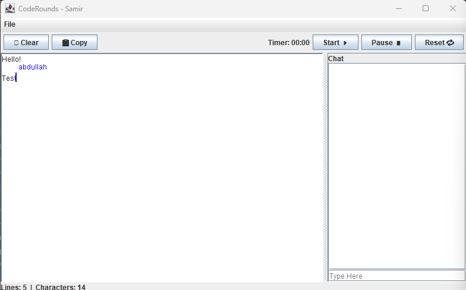

#  CodeRounds
A real-time collaborative coding interview platform built in Java, designed to streamline remote technical interviews with features for both interviewers and interviewees.

---

## Project Information

This project enables interviewers and interviewees to collaborate in real-time during coding interviews. It offers the ability to share code in an editor, track cursors, communicate via chat, and includes a secure login system for managing users. While running, you can open files to and save the text of the editor. There is also an included timer to help the interviewer and interviewees keep track of any set time constraints. The system is built using Java Sockets for client-server communication, Swing for the GUI, and a simple file system to save/load user code.

  

---

### Demonstration Of Functionality
The video below demonstrates and talks briefly about the different functions that our application performs.

[[]](https://drive.google.com/file/d/19YocCJGLePVzGYrIfh9vvlh6FI-3e3Dw/view?usp=sharing)

---

## How To Run

### Requirements
- In order to run, you must have Java 11 or later installed on your system. Refer to the "Resources" section near the bottom of the document for a link to Java 23.
- You must also have git installed to access the repository. Refer to the "Resources" section near the bottom of the document for a link to Git.

### Steps To Clone
1. Open a terminal.
2. Create a folder where you want to store the repository using `mkdir folderName`.
3. Then change directories to that folder using `cd folderName`.
4. Finally you will clone the repository into your current folder using `git clone https://github.com/OntarioTech-CS-program/w25-csci2020u-finalproject-team01.git .`.

### Steps To Run
To run the application, follow these steps:
  1. In `src/main/java/`, locate `Server.java` in the `/server/` folder and `Client.java` in the `/client/` folder.
  2. First, compile and run `Server.java`. If this fails to run due to port 8080 being unavailable, refer to the "Troubleshooting" section below.
  3. Then, compile and run 2 or more instances of `Client.java`.
  4. Login screens will appear. Create a new account(s) or refer to `users.csv` for 2 premade accounts.
  5. Once both clients are logged in, the editor will appear on the left and the chat on the right. There will also be a dropdown menu named "File" in the top left to open and save files.

### Troubleshooting
**Port unavailable/already in use:**
If the port being used by the program is already in use, there are 2 options:
  1. End the other process on your computer that is using port 8080.
  2. Change the port utilized by the application:
     - Go to line 9 in `Server.java` and change `private static final int PORT` to an available port on your machine.
     - Go to line 70 in `Client.java` and change the second parameter in `socket = new Socket("localhost", 8080);` to the port used in `Server.java`.
     - The ports in both files MUST match.

---

## Libraries and Dependencies

### Libraries
- `java.awt`: Was used for GUI components `Color` and `Rectangle` and Layout managers like `GridLayout` and `BorderLayout`.
- `javax.swing`: Was used for swing GUI components like `JFrame`, `JTextArea`, `JButton`, `JMenuBar`, and `JOptionPane`.
- `java.io`: Was used for file and streams like `File`, `FileReader`, `FileWriter`, `BufferedReader`, `BufferedWriter`.
- `java.net`: Was used for client-server communication using `Socket` and `ServerSocket`. It was also used for HTTP using `HttpClient`, `HttpRequest`, and `HttpResponse`.
- `java.nio.charset`: Was used for character endcoding using `StandardCharsets`.
- `java.util`: Was used for general utilities and collections like `Base64`, `Random`, `Map`, `List`, `ConcurrentHashMap`, and `CopyOnWriteArrayList`.
- `java.util.concurrent`: Was used for it's thread-safe concurrency utilities `ConcurrentHashMap` and `CopyOnWriteArrayList`.

### External Dependencies
This project uses only standard Java Library components.

---

## Resources
- Java 23: [Download Java 23](https://www.oracle.com/java/technologies/downloads/#java23)
- Git: [Download Git](https://git-scm.com/downloads)
  
---

## Contributors
**Project Group 1**\
Members:
  - Samir Ahmadi
  - Farid Jamshid
  - Abdullah Mustafa
  - Dillon Toshack
